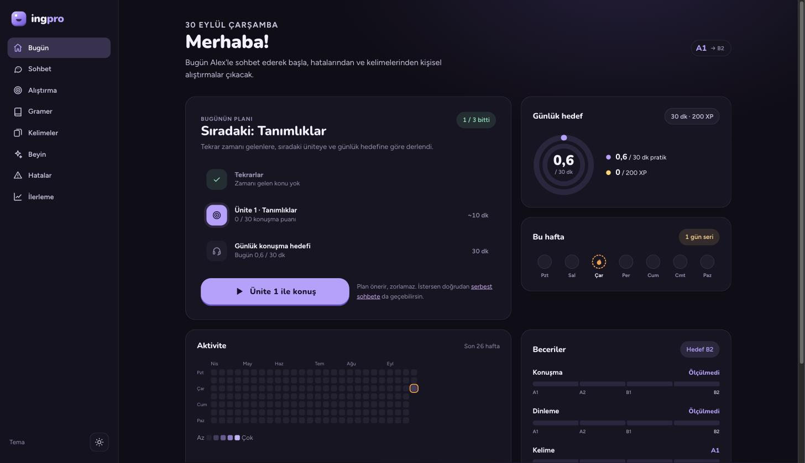
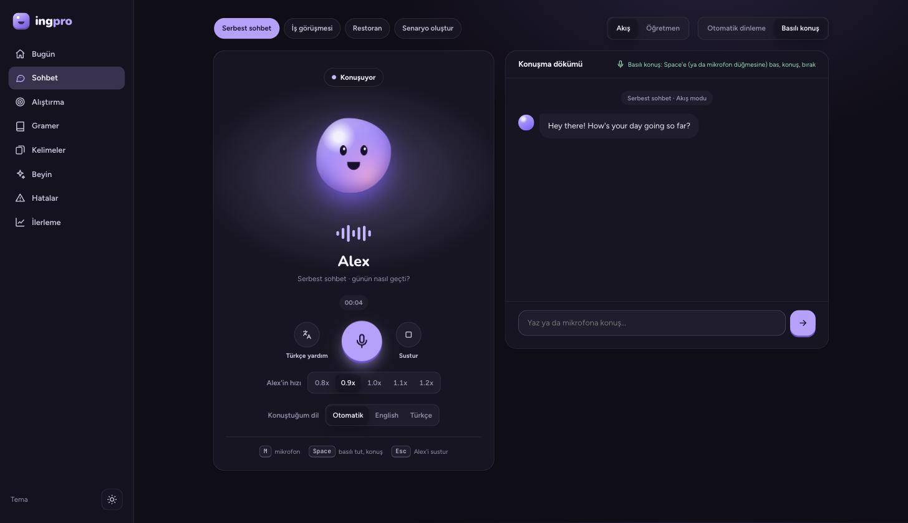
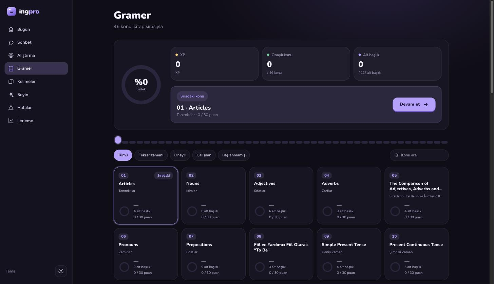
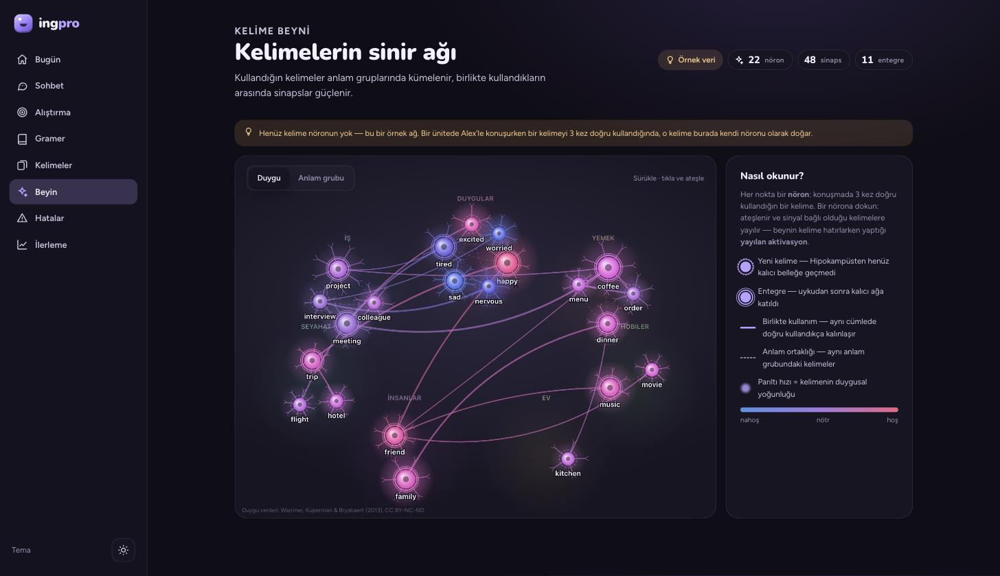

# ingpro

Beyin yapınızı modelleyerek, tamamen yerel çalışan bir İngilizce geliştirme asistanı. Sesli sohbet (STT/TTS), gramer ilerlemesini
FSRS + Hebbian bir "beyin" ile modelleyen bir sistem, ve isteğe bağlı olarak bu beyni bir Obsidian vault'una
yansıtan bir katman içerir.

## Ekran görüntüleri

| Bugün | Sohbet |
|---|---|
|  |  |

| Gramer | Kelime beyni |
|---|---|
|  |  |

## Gereksinimler

- **Apple Silicon Mac (M1/M2/M3/M4).** Ses motorları (`mlx-whisper`, Chatterbox) Apple'ın MLX framework'üne dayanıyor —
  Intel Mac, Windows ve Linux'ta çalışmaz.
- [`uv`](https://docs.astral.sh/uv/) (Python 3.12 paket yöneticisi)
- Node.js + npm
- **Claude Code CLI, kurulu ve giriş yapılmış** (`claude login`). Uygulama LLM için kendi API anahtarını değil,
  bilgisayarındaki Claude Code oturumunu kullanıyor — yani bunu kim çalıştırırsa **kendi** Claude aboneliği/kotası
  harcanıyor, başka kimsenin değil.

## Kurulum

```bash
./scripts/setup.sh
```

Bu script bağımlılıkları kurar, `.env` dosyasını `.env.example`'dan oluşturur, ses modellerini (~2 GB, ilk seferde)
ve kelime beyni için duygu veri setini indirir.

## Çalıştırma

```bash
./scripts/dev.sh      # ön planda, Ctrl+C ikisini de durdurur
# veya
./scripts/start.sh    # arka planda başlatır, hemen döner
./scripts/stop.sh      # arka planda çalışanı durdurur
```

Backend `:8765`, web arayüzü `:5173`'te açılır.

## Ayarlar

Tüm ayarlar isteğe bağlı; varsayılanlar `server/src/ingpro/config.py`'de. Örnekler için `.env.example`'a bak —
ses modeli/hızı, Türkçe TTS motoru, öğrenci profili dosyası, tutor modeli gibi seçenekleri kapsıyor.

## Özellikler

- **Sesli sohbet:** Serbest sohbet, iş görüşmesi (kendi pozisyonunu belirleyebiliyorsun), restoran senaryoları — ve
  serbest metinle kendi senaryonu AI'a ürettirebildiğin bir mod.
- **Gramer takibi:** Konuşma puanları (rule-based, LLM sadece dili değerlendiriyor, puanı kod veriyor) + ayrı bir
  nöron/sinaps/FSRS tabanlı tekrar sistemi (Gramer ekranındaki "Test et" akışı).
- **Kelime beyni:** Konuşmada 3 kez doğru kullanılan her kelime kendi "nöron"una kavuşuyor — FSRS ile hatırlanma,
  gerçek duygu-norm verisiyle (veya kapsam dışındaysa LLM tahminiyle) valence/arousal/dominance skoru, aynı anlam
  grubundaki ve birlikte kullanılan kelimeler arasında sinapslar. Uygulama içinde **Beyin** sekmesinde canlı bir
  ağ olarak görselleştiriliyor.
- **Obsidian entegrasyonu (isteğe bağlı):** `INGPRO_VAULT_DIR` ayarlanırsa hem gramer hem kelime beyni, kendi
  Markdown notları olarak bir Obsidian vault'una yansıtılıyor — sen not eklersen o kısım hiç ezilmiyor.

## Notlar

- Kitap tabanlı gramer içeriği (`content/grammar/yener.json`) ve kelime beyninin duygu veri seti
  (`content/vocab/warriner_vad.csv`) telif/lisans nedeniyle bu repoda yok; `setup.sh` bunları senin için indirir.

## Lisans

MIT — bkz. [LICENSE](LICENSE). Kelime beyninin duygu verileri ayrı bir lisansla (Warriner, Kuperman & Brysbaert 2013,
CC BY-NC-ND) geliyor ve repoya dahil değil; kaynağı uygulama içinde Beyin sekmesinde belirtiliyor.
